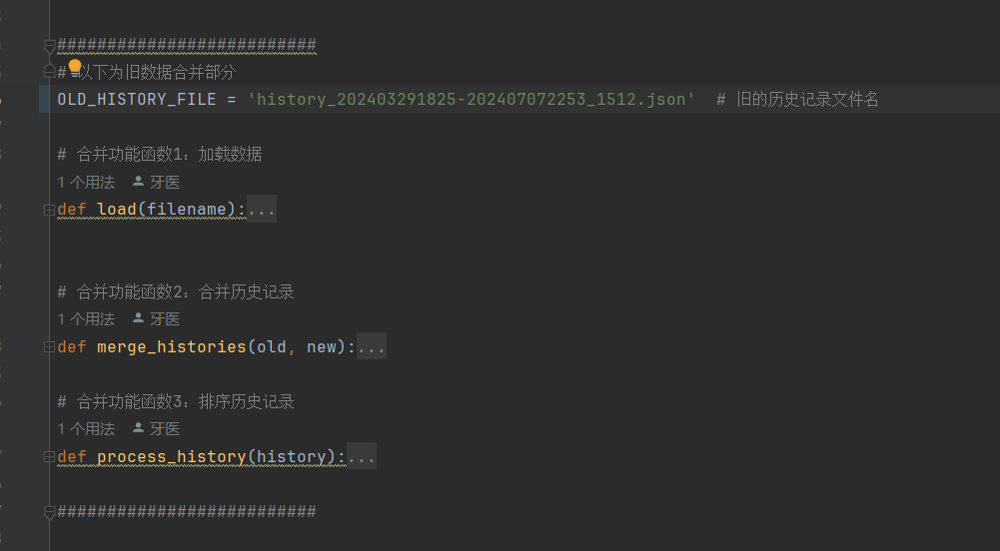
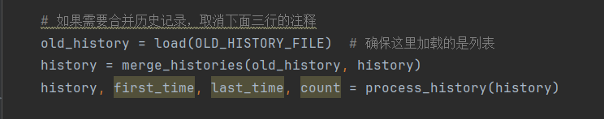

# B站钩沉

用 Python 获取 B 站播放历史记录，并且实现"增量备份"。


## 00 数据格式

### 00-01 直接获取

`https://api.bilibili.com/x/v2/history?pn=1`

<details>
	<summary>参数种类（待完成对照表，仅为展示）</summary>
	<pre><code>
* aid
* videos
* tid
* tname
* copyright
* pic
* title
* pubdate
* ctime
* desc
* state
* duration
* rights
  * bp
  * elec
  * download
  * movie
  * pay
  * hd5
  * no_reprint
  * autoplay
  * ugc_pay
  * is_cooperation
  * ugc_pay_preview
  * no_background
  * arc_pay
  * pay_free_watch
* owner
  * mid
  * name
  * face
* stat
  * aid
  * view
  * danmaku
  * reply
  * favorite
  * coin
  * share
  * now_rank
  * his_rank
  * like
  * dislike
  * vt
  * vv
* dynamic
* cid
* dimension
  * width
  * height
  * rotate
* season_id
* short_link_v2
* first_frame
* pub_location
* cover43
* favorite
* type
* sub_type
* device
* page
  * cid
  * page
  * from
  * part
  * duration
  * vid
  * weblink
  * dimension
    * width
    * height
    * rotate
  * first_frame
* count
* progress
* view_at
* kid
* business
* redirect_link
* bvid
	</code></pre>
</details>

<details>
    <summary>参数结构</summary>
    <pre><code>
{
    "code": 0,
    "message": "0",
    "ttl": 1,
    "data": [
        {
            "aid": 1006142226,
            "videos": 1,
            "tid": 207,
            "view_at": 1720424374,
            ......
        },
        {
            "aid": 1006142226,
            "videos": 1,
            "tid": 207,
            "view_at": 1720424374,
            ......
        },
        {
            "aid": 1006142226,
            "videos": 1,
            "tid": 207,
            "view_at": 1720424374,
            ......
        },
    ]
}</code></pre>
</details>

一页有300条数据，总共能获取1500条数据/三个月的数据

### 00-02 处理中

<details>
    <summary>history参数</summary>
    <pre><code>
history = 
{"all":
    [
    	{数据1},
    	{数据2},
    	{数据3},
    ]
}
    </code></pre>
</details>

### 00-03 导出

<details>
    <summary>导出格式</summary>
    <pre><code>
xxx.json：{list}：
	1. 字典{dict}：只有一个元素的字典。以后方便加其他东西（？）
		1. all{dict}：其键值：
			1. 字典1：存着主要的数据，其中有一项`"view_at": 1720364025,` 作为唯一的id
			2. 字典2：同上
			3. 字典3：同上
			4. 。。。。。。
	2. 第一条信息的时间{list}：时间，时间戳
	3. 最后一条信息的时间{list}：时间，时间戳
	4. count{int}
    </code></pre>
</details>

`history`后面加上开头和结尾记录的时间，还有总计数，组成list

最后开头结尾总计数命名文件名

## 01 逻辑

### 01-01 获取请求 Api 接口与 Cookie

实现起来非常容易，获取 cookie 模拟请求即可

1. 使用 chrome 浏览器

2. 登陆 [B 站](https://www.bilibili.com)，进入历史记录 [https://www.bilibili.com/account/history](https://www.bilibili.com/account/history) 

3. 在网页任意位置，鼠标右键 `检查`


4. 按照下图所示，进入 `Network` 页面，筛选框输入 `history`，对结果进行筛选，页面滚轮往下即可看到浏览过程中的历史记录请求的 `Header`


5. 将 Header 下， cookie 一行的字符串复制出来到一个 `cookies.txt` 文本里


cookies请保存好


### 01-02 伪造浏览器请求

使用 cookie 模拟请求

```python
import json
import requests


def read_cookies_file(filename):
    """read cookie txt file
    :param filename: (str) cookies file path
    :return: (dict) cookies
    """
    with open(filename, 'r') as fp:
        cookies = fp.read()
        return cookies


def get_header(filename):
    cookie = read_cookies_file(filename)
    headers = {
        'Accept': '*/*',
        'Accept-Encoding': 'gzip, deflate, br',
        'Accept-Language': 'zh-CN,zh;q=0.9,en-US;q=0.8,en;q=0.7',
        'Connection': 'keep-alive',
        'Cookie': cookie,
        'Host': 'api.bilibili.com',
        'Referer': 'https://www.bilibili.com/account/history',
        'User-Agent': 'Mozilla/5.0 (Macintosh; Intel Mac OS X 10_14_2) AppleWebKit/537.36 '
                      '(KHTML, like Gecko) Chrome/71.0.3578.98 Safari/537.36'
    }
    return headers


def req_get(headers, url):
    resp = requests.get(url, headers=headers)
    return json.loads(resp.text)
```

### 01-03 获取历史数据信息

直接获取，一般是前五页由内容，第六页开始没内容。加了个判断语句，报错再看。


### 01-04 增量备份

取消三段代码函数的注释，取消主函数的注释，就能正常用啦



​	

* 融合。提取出新的history的数据，和旧的数据的view_at数据相对比，剔除重复，保留新增的
* 排序。时间戳由大到小排序

### 01-05 导出

文件名为：history+开始和结束的时间


## todo

- [x] 增量备份
- [ ] 服务器的自动增量备份脚本
- [ ] 统计功能
- [ ] GUI界面
- [ ] （可能）作为bilibil-evolved的一个组件
- [ ] 结合收藏夹数据，接入本地大模型，结合RAG用，方便做知识库搜索。
