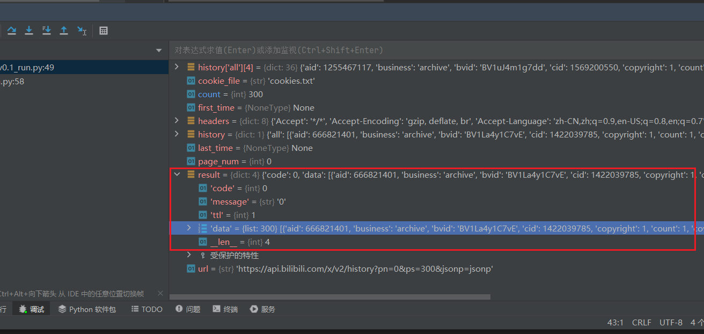

### 直接信息

`https://api.bilibili.com/x/v2/history?pn=1`

```
{
    "code": 0,
    "message": "0",
    "ttl": 1,
    "data": [
        {
            "aid": 494635811,
            "videos": 1,
            "tid": 231,
            "tname": "计算机技术",
            "copyright": 1,
            "pic": "http://i0.hdslb.com/bfs/archive/14b03c8711ff2fa84baf4cb8111a52a0da71ad6d.jpg",
            "title": "42K+ star！开源Notion 平替笔记推荐",
            "pubdate": 1702375702,
            "ctime": 1702375703,
            "desc": "今天我们来推荐一款在GitHub超过43K Star的开源项目,开源Notion 平替笔记：AppFlowy。\n官方网站：https://www.appflowy.io/\nGitHub地址：https://github.com/AppFlowy-IO/AppFlowy",
            "state": 0,
            "duration": 141,
            "rights": {
                "bp": 0,
                "elec": 0,
                "download": 0,
                "movie": 0,
                "pay": 0,
                "hd5": 1,
                "no_reprint": 1,
                "autoplay": 1,
                "ugc_pay": 0,
                "is_cooperation": 0,
                "ugc_pay_preview": 0,
                "no_background": 0,
                "arc_pay": 0,
                "pay_free_watch": 0
            },
            "owner": {
                "mid": 65564239,
                "name": "IT咖啡馆",
                "face": "https://i1.hdslb.com/bfs/face/9d5e047e428b1cb235ab0e60d6371c0808f5c121.jpg"
            },
            "stat": {
                "aid": 494635811,
                "view": 75993,
                "danmaku": 3,
                "reply": 272,
                "favorite": 2612,
                "coin": 273,
                "share": 239,
                "now_rank": 0,
                "his_rank": 0,
                "like": 1106,
                "dislike": 0,
                "vt": -1,
                "vv": 75993
            },
            "dynamic": "",
            "cid": 1364353026,
            "dimension": {
                "width": 2446,
                "height": 1080,
                "rotate": 0
            },
            "season_id": 1963160,
            "short_link_v2": "https://b23.tv/BV1GN411L7ez",
            "first_frame": "http://i0.hdslb.com/bfs/storyff/n231212sa2bbwuufqi2s4r1tlwqu0dzi_firsti.jpg",
            "pub_location": "北京",
            "cover43": "",
            "favorite": true,
            "type": 3,
            "sub_type": 0,
            "device": 2,
            "page": {
                "cid": 1364353026,
                "page": 1,
                "from": "vupload",
                "part": "42K+ star！开源Notion 平替笔记推荐",
                "duration": 141,
                "vid": "",
                "weblink": "",
                "dimension": {
                    "width": 2446,
                    "height": 1080,
                    "rotate": 0
                },
                "first_frame": "http://i0.hdslb.com/bfs/storyff/n231212sa2bbwuufqi2s4r1tlwqu0dzi_firsti.jpg"
            },
            "count": 1,
            "progress": 1,
            "view_at": 1720276128,
            "kid": 494635811,
            "business": "archive",
            "redirect_link": "https://www.bilibili.com/video/av494635811",
            "bvid": "BV1GN411L7ez"
        },
```

### 一页数据数量问题


一页有26400行左右（26403、26408、26394。。。），~~大概90-100行一个数据，也就是一页有260条数据左右~~


直接看代码

result = {dict:4}

`'data' = {list:300}` 这个表示 `'data'` 是一个键，它对应的值是一个列表（`list`），并且这个列表包含 300 个元素。

```json
result=

{
    "code": 0,
    "message": "0",
    "ttl": 1,
    "data": [
        {},
        {}
        ]
}
```




GPT4解释：

Python的列表是一个非常灵活的数据结构，它可以存储任何类型的对象，包括字典。在你的例子中，`'data'`键对应的值是一个列表，这个列表的每一项都是一个字典，这个字典包含了一条历史记录的所有信息。

这是一个简单的例子，展示了如何在列表中存储字典：

```
data = [{'name': 'John', 'age': 30}, {'name': 'Jane', 'age': 25}]
```

在这个例子中，`data`是一个列表，包含两个字典。每个字典都有两个键：`'name'`和`'age'`。

你可以像这样访问列表中的字典：

```
print(data[0]['name'])  # 输出：John
```

这行代码会先从列表中获取第一个元素（一个字典），然后从这个字典中获取`'name'`键对应的值。

### 一二三级目录表示

* aid
* videos
* tid
* tname
* copyright
* pic
* title
* pubdate
* ctime
* desc
* state
* duration
* rights
  * bp
  * elec
  * download
  * movie
  * pay
  * hd5
  * no_reprint
  * autoplay
  * ugc_pay
  * is_cooperation
  * ugc_pay_preview
  * no_background
  * arc_pay
  * pay_free_watch
* owner
  * mid
  * name
  * face
* stat
  * aid
  * view
  * danmaku
  * reply
  * favorite
  * coin
  * share
  * now_rank
  * his_rank
  * like
  * dislike
  * vt
  * vv
* dynamic
* cid
* dimension
  * width
  * height
  * rotate
* season_id
* short_link_v2
* first_frame
* pub_location
* cover43
* favorite
* type
* sub_type
* device
* page
  * cid
  * page
  * from
  * part
  * duration
  * vid
  * weblink
  * dimension
    * width
    * height
    * rotate
  * first_frame
* count
* progress
* view_at
* kid
* business
* redirect_link
* bvid

### 领悟笔记

* 过程：抓取的json有四个字典，获取其中data字典（字典里面存的是列表，这个列表里面存的还是字典），然后append加起来之后，组成导出的json

* 包：`os`、`json`、`time`和`datetime`都是Python内置的模块。需要安装request

* 数据格式：

  * 网页捕获的数据，是dict：

    ```json
    {
        "code": 0,
        "message": "0",
        "ttl": 1,
        "data": [
        ]
    }
    ```

  * 转换出来的数据。{list}里面：all {dict}（里面包着列表，列表里面装着一堆{dict}）、头尾 {int}、count {int}

    ```json
    [
        {
            "all": [
            ]
        },
        1720364025,
        1719658314,
        1512
    ]
    ```

  * 用于融合的数据。

* 中间变量history只有all，最后和时间戳与count组成最终文件

```json
json：{list}
	1. all：{dict} 只有一个元素的字典，其键值：
		1. 字典1：存着主要的数据，其中有一项`"view_at": 1720364025,` 作为唯一的id
		2. 字典2：同上
		3. 字典3：同上
		4. 等等等等，此处字典数据结构都一样
	2. 头时间戳：{int}
	3. 尾部时间戳：{int}
	4. count：{int}
```


* 要想好数据结构如何处理才行，否则最后很容易乱掉


### log

* 解决了数据流中，格式问题

  > 感觉这次数据处理核心就是数据格式问题


## 01 参考内容

### 01-01 github的B站 api 收集项目

* 项目地址：[哔哩哔哩-API收集整理【不断更新中....】](https://github.com/SocialSisterYi/bilibili-API-collect)
* `https://api.bilibili.com/x/web-interface/history/cursor`
* doc：[历史记录 | BAC Document (socialsisteryi.github.io)](https://socialsisteryi.github.io/bilibili-API-collect/docs/history_toview/history.html)


### 01-02 原本项目内容

* `http://api.bilibili.com/x/v2/history?pn=页码`
  * 获取自己历史记录 来自uid:176936889(GET 返回json 需cookie)
  * 来自：[BilibiliAPI 合集 含个人、视频、直播等信息 - 哔哩哔哩](https://www.bilibili.com/read/cv12357091/)


| ⚠⚠⚠⚠⚠⚠注意⚠⚠⚠⚠⚠⚠<br /><br />需要保存好cookies，现在B站cookies过期时间大概是1天<br /><br />⚠⚠⚠⚠⚠⚠⚠⚠⚠⚠⚠⚠⚠⚠ |
| :----------------------------------------------------------: |


